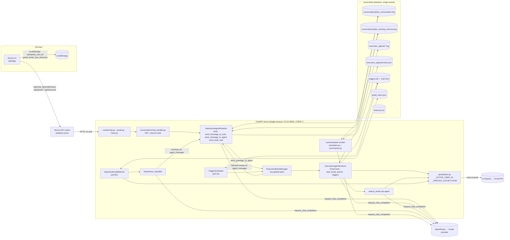

# OpenPoke — Current Memory & Data-Flow Architecture (as-built)

Baseline: commit `5b5f635` (main). All paths are relative to the repo root. Every claim cites code
or a test in [TEST_RESULTS.md](TEST_RESULTS.md). Nothing in `server/` was modified.

## 1. Component architecture



Key structural facts:

- **One conversation, one user.** No request carries a user/session identity; all stores are process-global singletons
  (`get_conversation_log()`, `get_working_memory_log()`, `get_agent_roster()`, `get_trigger_service()`).
- **Two memory tiers only**: (a) the raw append-only conversation log, and (b) "working memory" = one LLM-written
  summary blob plus a verbatim copy of the not-yet-summarised tail. There is no fact store, no retrieval, no embeddings.
- **Execution agents have their own, separate memory**: one append-only log per agent *name*, injected wholesale into
  that agent's system prompt (`agents/execution_agent/agent.py:73`). They never see the interaction transcript.
- **Gmail identity is in RAM** (`services/gmail/client.py:24`): set by whichever client last called `/gmail/connect`
  or `/gmail/status`; lost on restart.

## 2. Data flow — one user turn and its derived copies

```mermaid
sequenceDiagram
  autonumber
  participant U as User/UI
  participant API as /chat/send
  participant IA as Interaction agent
  participant CONV as poke_conversation.log
  participant WM as poke_working_memory.log
  participant OR as OpenRouter
  participant EA as Execution agent
  participant XL as execution_agents/<slug>.log
  participant GM as Composio/Gmail
  participant S as Summarizer

  U->>API: POST {messages:[...]} (only the LAST user msg is used)
  API-->>U: 202 (empty body; UI polls /chat/history)
  API->>IA: asyncio task execute(text)
  IA->>WM: render_transcript() = summary + raw tail  (taken BEFORE appending)
  IA->>CONV: append <user_message>   (and schedule summarisation)
  IA->>WM: append same entry (2nd copy)
  loop ≤8 iterations
    IA->>OR: system prompt + <conversation_history> + <active_agents> + <new_user_message> + tool turns
  end
  IA->>CONV: <poke_reply> via send_message_to_user / send_draft  (+WM copy)
  opt delegation
    IA->>XL: <agent_request> full instructions
    IA->>EA: create_task(execute)
    EA->>OR: system prompt + ENTIRE <slug>.log + instructions
    EA->>GM: tools.execute (draft bodies, queries, …)
    GM-->>EA: full emails (12 fields incl. clean_text)
    EA->>XL: <agent_action> args[:200], <tool_response> result[:500], <agent_response> full
    EA->>IA: batch "[SUCCESS] name: response" → handle_agent_message
    IA->>CONV: <agent_message> (verbatim exec output) + <poke_reply>
  end
  Note over CONV,S: when unsummarised entries ≥ threshold+tail (100+10)
  S->>OR: previous summary + entries[0..99] (user msgs, replies, agent msgs, wait reasons)
  S->>WM: rewrite: summary_info{last_index} + summary + entries after cutoff
  Note over CONV: raw log is NEVER truncated
```

Background producers that write into the same conversation:

- **Important-email watcher** (`services/gmail/importance_watcher.py`): every poll, each *new* inbox message
  → classifier LLM (full body) → if "important", the LLM summary is injected as
  `agent_message "Important email watcher notification: …"` → interaction agent → `poke_reply`. OTPs are explicitly
  in scope for "important" (`importance_classifier.py:30,50`).
- **Trigger scheduler**: due trigger → `ExecutionBatchManager().execute_agent(agent_name, payload)` → same flow as delegation.

### How context is reconstructed on a later turn

`InteractionAgentRuntime._load_conversation_transcript()` (`agents/interaction_agent/runtime.py:194`):

1. If summarisation is enabled (always, threshold 100) → `WorkingMemoryLog.render_transcript()`:
   `<conversation_summary>` (if any) followed by **every** unsummarised entry verbatim (`user_message`,
   `agent_message`, `poke_reply`, `wait`), HTML-escaped.
2. Only if that renders empty → whole raw `poke_conversation.log`.

Steady state therefore = 1 summary + between 10 and 109 raw entries. The execution agent instead gets its full
per-name log with no limit (`conversation_limit=None`).

### Summarisation mechanics (`services/conversation/summarization/`)

| Aspect | Behaviour | Evidence |
|---|---|---|
| Trigger | Every log append calls `schedule_summarization()`; worker runs if `unsummarised ≥ threshold + tail` (100 + 10 = **110 entries ≈ 55 turns**) | `summarizer.py:91`, test S3 (fired at entry 110) |
| Batch | Oldest **100** entries (`[:threshold]`), tail of ≥10 kept raw | `summarizer.py:94`, test S3 (indices 0–99) |
| Input | previous summary + batch rendered as `[i] user message: …` / `poke reply` / `agent message` / `wait` | `prompt_builder.py`, captures |
| Output | free-text 5-section briefing, *rebuilt from scratch* each run; rule 5: "include all … identifiers" | `prompt_builder.py:53` |
| Persistence | Rewrites WM file atomically (tmp + replace); `last_index` = conversation-log line index | `working_memory_log.py:149-167` |
| Raw log | Untouched; keeps growing forever | test S3 (114 lines after summarising) |
| Failure | 2 attempts per pass; no backoff; every subsequent append re-triggers, resending the same batch | test S5 (26 calls in 7 turns) |
| Config | `conversation_summary_threshold/tail_size` are hard-coded Field defaults (no env var) | `config.py:71` |

## 3. Persistence locations

| # | Location | Format | Written by | Contents (sensitivity) | Read back into LLM? | Retention / compaction | Cleared by `DELETE /chat/history`? | User-scoped? |
|---|---|---|---|---|---|---|---|---|
| P1 | `server/data/conversation/poke_conversation.log` | one XML-ish tag per line, HTML-escaped, `\n`-collapsed | `ConversationLog._append` (`services/conversation/log.py:68`) | Every user message, every reply, drafts (to/subject/body), execution results, watcher email summaries (OTPs), wait reasons — **verbatim** | Fallback only; source for summarizer | **Forever**, never compacted | Yes (unlink) — but in-flight tasks re-create it (S2) | No |
| P2 | `server/data/conversation/poke_working_memory.log` | `summary_info` JSON + `conversation_summary` + duplicate of unsummarised entries | `WorkingMemoryLog` | Same as P1 for the tail (2nd copy) + LLM summary | **Every interaction turn** | Rewritten at each summarisation | Yes (re-initialised) — in-flight summariser re-writes old summary (S6) | No |
| P3 | `…/poke_working_memory.tmp` | transient | `write_summary_state` | Full WM content | — | Deleted after rename | n/a | No |
| P4 | `server/data/execution_agents/<slug(agent_name)>.log` | tag-per-line | `ExecutionAgentLogStore` | Full instructions, tool args (200 chars), tool results (500 chars → email bodies/OTPs), full final responses | **Every call of that agent, whole file** | Forever, unbounded | Yes (glob `*.log`) — re-created by in-flight agent (S2) | No (keyed by LLM-chosen name; slug collisions merge) |
| P5 | `server/data/execution_agents/gmail-execution-agent.log` | same | `tools/gmail.py:_execute` | **Untruncated** Gmail tool args: recipients, cc/bcc, subjects, draft/reply bodies | No (orphan journal) | Forever | Yes | No |
| P6 | `server/data/execution_agents/task-email-search.log` | same | `search_email/tool.py` | Gmail search queries + counts | No | Forever | Yes | No |
| P7 | `server/data/execution_agents/roster.json` | JSON list | `AgentRoster` | Every agent name ever created (names are descriptive, e.g. "Email to Sharanjeet") | Yes, as `<active_agents>` every turn | Never pruned | Yes | No |
| P8 | `server/data/triggers.db` (+`-wal`, `-shm`) | SQLite WAL | `TriggerStore` | Trigger `payload` (free-text instructions), schedule, timezone, `last_error` | Payload becomes exec-agent instructions on fire | Rows kept after completion (`status=completed`) | `DELETE FROM triggers` — **bytes remain in db + WAL** (S1) | Column `agent_name` only |
| P9 | `server/data/gmail_seen.json` | JSON list ≤300 | `GmailSeenStore` | Gmail message IDs | No | Rolling 300 | **No** | No |
| P10 | `server/data/timezone.txt` | text | `TimezoneStore` | IANA timezone (location signal) | Indirectly (timestamps) | Forever | **No** | No |
| P11 | Process memory | — | `gmail/client.py` | `_ACTIVE_USER_ID`, `_PROFILE_CACHE` (Gmail profile incl. address), batch state, summariser flags | — | Until restart | No | Global |
| P12 | Process stdout/stderr (persisted if redirected, e.g. `.server.log`) | text | `logger.*` | Agent names, Gmail search instructions/queries (`search_email/tool.py:95`), draft recipient (`interaction_agent/tools.py`), exception strings; `extra={}` fields are **not** rendered by the formatter | No | Operator-controlled | No | No |
| P13 | Browser `localStorage` | key/value | `web/components/SettingsModal.tsx` | `openpoke_user_id`, `gmail_connection_request_id`, `gmail_connected`, `gmail_email`, `user_timezone` | No | Until cleared | No | Per browser |
| P14 | **OpenRouter + routed model provider** | external | `openrouter_client/client.py` | Everything in the model-boundary table below | — | Provider policy; no ZDR / `provider` / `user` fields set | **No** | Single API key |
| P15 | **Composio** | external | `gmail/client.py` | OAuth grant for Gmail; every tool call's arguments (draft bodies, queries) | — | Composio policy | No (Gmail disconnect is a separate endpoint) | `user_id` = client-supplied or `web-<pid>` |

## 4. External-model boundaries

All five go through one function, `request_chat_completion` (`server/openrouter_client/client.py`): single
`OPENROUTER_API_KEY`, `stream: false`, 60 s timeout, default model `anthropic/claude-sonnet-4` for every role
(`config.py:54-58`). No request sets data-collection/ZDR provider preferences, a `user` id, or does any redaction.

| # | Caller (code) | When it fires | What is sent | Gmail fields | Calls per trigger |
|---|---|---|---|---|---|
| B1 | **Interaction agent** `agents/interaction_agent/runtime.py:_make_llm_call` | Every user message; every execution batch result; every important-email notification | 10.4 KB system prompt; `<conversation_history>` = summary + 10–109 raw entries (all user text, replies, drafts, exec results, OTP summaries); `<active_agents>` = full roster; new message; 4 tool schemas; in-turn tool calls/results | Indirect: whatever exec agents / watcher summaries wrote into the log (S1: search OTP + address reached B1) | 2–8 (each resends everything) |
| B2 | **Execution agent** `agents/execution_agent/runtime.py:_make_llm_call` | Each `send_message_to_agent`; each trigger fire | Exec system prompt + **entire** per-agent log; instructions from B1; tool results (full email objects) | All 12 fields of each search result incl. full `clean_text` | ≤8 |
| B3 | **Search sub-agent** `agents/execution_agent/tasks/search_email/tool.py:_run_email_search` | Each `task_email_search` | `"Please help me find emails: {query}"` + raw fetch results (as Python `repr`, see F-10) | `id, thread_id, query, subject, sender, recipient, timestamp, label_ids, clean_text, has_attachments, attachment_count, attachment_filenames` | ≤8 |
| B4 | **Email importance classifier** `services/gmail/importance_classifier.py` | Every new inbox email seen by the watcher (poll 60 s, lookback 10 min, ≤50) — **without any user request** | `Sender, Recipient, Subject, Received, Thread ID, Labels, Has attachments, Attachment filenames` + **full cleaned body** | Same 8 headers + body | 1 per email |
| B5 | **Summarizer** `services/conversation/summarization/summarizer.py` | unsummarised ≥ 110 entries; retried on every append while failing | Previous summary + 100 raw entries (user msgs, replies, agent messages, wait reasons) | Indirect, via agent_message / poke_reply entries | 1–2 per pass; storm on failure |

Non-LLM external boundary: **Composio** (`execute_gmail_tool`) receives every Gmail tool argument and returns full
message payloads; the client is constructed with `COMPOSIO_API_KEY`.
